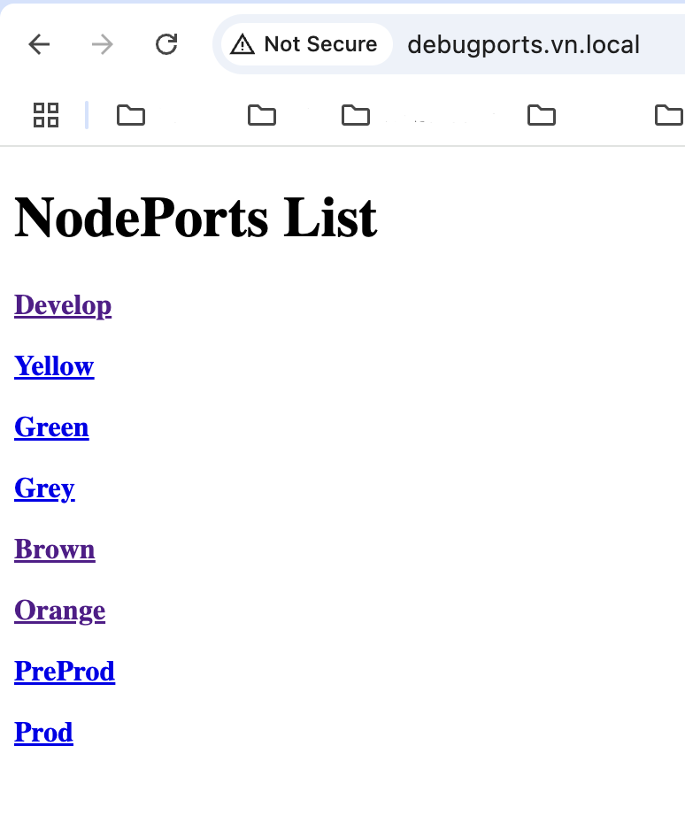

# k8s-nodeport

This repository autoamtions the kubernetes application services nodeports list

## Repository Structure

    .
    ├── develop-cluster
    │   ├── Deployment.yaml
    │   ├── Dockerfile
    │   ├── nginx.con
    │   ├── get-nodeports.sh
    │   └── index.html
    ├── README.md
    ├── .gitlab-ci.yml

If you want to export kubernetes svc with nodeport in java application debug port.You can use this script

## env list

## nodeport list for each env

